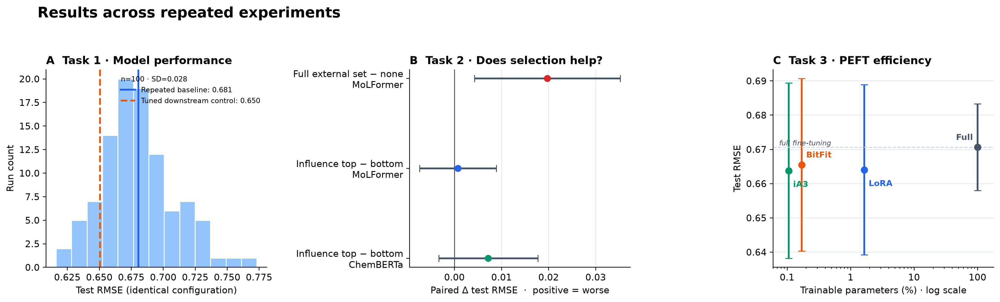

# Lipophilicity Prediction with MoLFormer

Can additional molecular data improve a pretrained chemical language model?
This project fine-tunes MoLFormer-XL to predict lipophilicity (`logD`) from
SMILES, then studies external-data selection and parameter-efficient
fine-tuning (PEFT). The final evaluation contains **3,805 completed runs** over
repeated data splits and initialization seeds, plus **348 HPO trials**.

The work was organized around three tasks:

1. Fine-tune and optimize MoLFormer-XL for molecular regression.
2. Rank external molecules with influence functions and test whether the
   selected samples improve prediction.
3. Compare alternative selectors and PEFT methods: BitFit, LoRA, and iA3.

The main finding is: MoLFormer learned the target task, and PEFT matched
full fine-tuning while updating far fewer parameters. The external dataset did
not improve prediction; using all of it increased error, and influence-based
selection performed no better than its reversed ranking. The selection result
also replicated with ChemBERTa.



Panel A shows variation over 100 identical MoLFormer training configurations.
Panel B gives paired Task 2 contrasts; intervals crossing zero indicate no
detectable difference. Panel C compares predictive performance with the share
of model parameters updated in Task 3. Lower RMSE is better; error bars are 95%
confidence intervals.

## Task 1 — Molecular regression

We added a regression head to `ibm/MoLFormer-XL-both-10pct` and trained it on
the 4,200-molecule [MoleculeNet Lipophilicity
dataset](https://doi.org/10.1039/C7SC02664A). Each stratified split used 70% for
training, 10% for validation, and 20% for testing. Hyperparameters were selected
from validation loss only; the baseline HPO study completed 73 trials and
pruned 71 without failures.

| Evaluation                 | Runs |                  Test RMSE |
| -------------------------- | ---: | -------------------------: |
| Repeated baseline          |  100 |           0.6806 ± 0.0055 |
| Tuned downstream control   |   15 | **0.6505 ± 0.0135** |
| Original course submission |    1 |                     0.6178 |

The intervals are 95% confidence intervals of the mean. The original
submission value is retained for historical context, but it is a single run;
the repeated evaluations are better estimates of expected performance. The
best HPO validation objective corresponds to **0.5867 RMSE-equivalent**. It is
not a held-out test result because the study optimized mean squared validation
error across two splits.

### Published context

RMSE is the standard primary regression metric used by MoleculeNet and the
comparison studies below, so this README reports error in RMSE throughout.
Scores still depend strongly on the split protocol: random splits and scaffold
splits answer different generalization questions.

A recent [MolDualNet study](https://www.nature.com/articles/s42004-026-02142-z)
retrained several models on the same random 80/10/10 splits. The closest
published context for our separate stratified 70/10/20 evaluation is:

| Model                                | Protocol            |       Lipophilicity RMSE |
| ------------------------------------ | ------------------- | -----------------------: |
| MolDualNet                           | Random 80/10/10     | **0.584 ± 0.004** |
| MoLFormer-XL reproduction            | Random 80/10/10     |           0.613 ± 0.016 |
| **Ours — tuned MoLFormer-XL** | Stratified 70/10/20 | **0.650 ± 0.027** |
| D-MPNN                               | Random 80/10/10     |           0.669 ± 0.047 |
| ChemBERTa-2                          | Random 80/10/10     |           0.683 ± 0.029 |

Values here are mean ± run-to-run SD. Our result is about 6% higher than the
published MoLFormer reproduction and 11% higher than MolDualNet, while being
numerically lower than the D-MPNN and ChemBERTa-2 entries. The protocols are
not identical, so this is positioning rather than a formal leaderboard.

Other published results include **0.5289 RMSE** in the [original MoLFormer
paper](https://arxiv.org/html/2106.09553), **0.534 ± 0.006** under scaffold
splitting for [SCAGE](https://www.nature.com/articles/s41467-025-59634-0), and
**0.560** under a custom stacking protocol for
[FusionCLM](https://link.springer.com/article/10.1186/s13321-025-01073-6).

## Task 2 — Influence-based data selection

We estimated each of 300 external molecules' effect on validation loss using
the influence-function formulation of [Koh and Liang
(2017)](https://arxiv.org/abs/1703.04730) and the
[LiSSA](https://arxiv.org/abs/1602.03943) inverse-Hessian approximation. The
study compared influence-top, influence-bottom, random, clustering, target
alignment, all external data, and no-external-data controls at matched sample
budgets. Comparisons were paired on split and seed.

| Paired comparison                    |                Δ test RMSE |         p-value |
| ------------------------------------ | --------------------------: | --------------: |
| Influence top − bottom, MoLFormer   |           +0.0008 ± 0.0082 |           0.858 |
| All external data − none, MoLFormer | **+0.0197 ± 0.0155** | **0.025** |
| Influence top − bottom, ChemBERTa   |           +0.0072 ± 0.0105 |           0.203 |

No partial-data selector outperformed the no-external control, and the five
MoLFormer selectors did not differ overall (Friedman `p=0.764`). ChemBERTa
repeated the same comparison over 15 matched blocks and also found no strategy
difference (`p=0.378`). Influence selection therefore did not provide a useful
sample ordering on either backbone.

The external set also occupied a different chemical regime: its molecules were
smaller, less ring-rich, and less lipophilic. External-versus-training
MoLFormer embedding MMD was **12.7×** the within-training baseline
(permutation `p=0.002`). This distribution shift is consistent with the error
increase observed when all 300 external molecules were used.

## Task 3 — Data selection and PEFT

We crossed the selection methods with full fine-tuning and three PEFT
approaches: [BitFit](https://arxiv.org/abs/2106.10199),
[LoRA](https://arxiv.org/abs/2106.09685), and
[(IA)³](https://arxiv.org/abs/2205.05638). Each method was tuned separately and
evaluated over 5 splits × 3 seeds.

| Method           | Trainable parameters | Share of model |                  Test RMSE |
| ---------------- | -------------------: | -------------: | -------------------------: |
| iA3              |               46,849 |          0.11% | **0.6638 ± 0.0256** |
| LoRA             |              738,049 |          1.66% |           0.6640 ± 0.0248 |
| BitFit           |               75,265 |          0.17% |           0.6655 ± 0.0252 |
| Full fine-tuning |           44,375,809 |           100% |           0.6707 ± 0.0126 |

These are the no-external-data controls with 95% confidence intervals. PEFT
retained full-fine-tuning performance while updating between 0.11% and 1.66%
of the model. None of the external-data selectors significantly changed its
method's performance; the smallest uncorrected p-value among 16 comparisons
was 0.205.

## Reproducibility

The experiment runner uses stable hashed run specifications, deterministic
evaluation, validation-only model selection, paired split/seed controls, and
resumable sharding. All **3,805/3,805** planned runs completed successfully
with no failed or duplicate IDs. The full chronology and additional diagnostics
are preserved in [`EXPERIMENT_LOG.md`](./EXPERIMENT_LOG.md).

Python 3.8+ and a CUDA-capable GPU are required for training.

```bash
python -m venv .venv
source .venv/bin/activate
pip install -r requirements.txt

python scripts/analyze.py
python scripts/plot_results.py
python scripts/run_experiments.py --help
```

| Path                                                      | Purpose                                                      |
| --------------------------------------------------------- | ------------------------------------------------------------ |
| [`nnti/`](./nnti/)                                       | Data, models, training, influence, PEFT, and selection code  |
| [`scripts/experiment.py`](./scripts/experiment.py)       | Executes one reproducible experiment specification           |
| [`scripts/make_manifest.py`](./scripts/make_manifest.py) | Builds the complete experiment plan                          |
| [`experiments/`](./experiments/)                         | Manifest, per-run results, influence scores, and HPO studies |
| [`scripts/analyze.py`](./scripts/analyze.py)             | Statistical analysis                                         |
| [`scripts/plot_results.py`](./scripts/plot_results.py)   | Regenerates the README figures                               |

## Project history

The original team submission for **Neural Networks: Theory and Implementation
(WS 2024/25)** at Saarland University.

## License

[MIT](./LICENSE)
